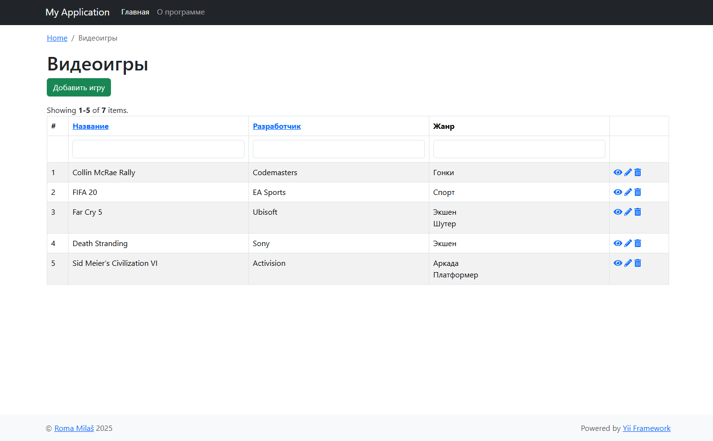

# CRUD on Yii2

---
## Описание проекта

---
### 1.  Структура проекта (основная)
   - **config** - Конфигурационные файлы проекта
   - **controllers** - Контроллеры проекта
   - **models** - Модели проекта
   - **views** - Представления проекта

### 2. Развёртывание

- Склонируйте проект `git clone https://github.com/romamilash/shipment.git`.
- Настройте корневой маршрут до сайта в папку **/web**.
- Установите зависимости `composer install`.
- Выполните консольную команду `yii migrate`.

### 3. Техническое задание

   Необходимо сделать web api для взаимодействия с базой данных, в которой хранятся данные о видеоиграх, реализовать CRUD операции с ней, а также метод для получения списка игр определённого жанра.
   Информация о игре: название, студия разработчик, несколько жанров, которым соответствует игра.
   Используя любой фреймворк или без фреймворка.
   Действуя согласно SOLID MVC MVVM.
   Сделать минимум 3 слоя абстракций, а контроллеры "тонкими".
